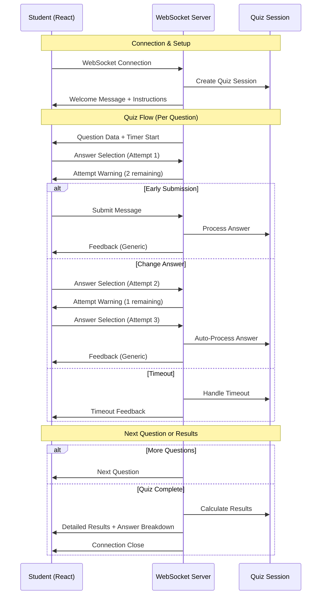

## 📋 System Overview

### Core Features
- ✅ Real-time WebSocket communication
- ✅ 5 MCQ questions with 10-second timer per question
- ✅ 3 attempts to change answer per question
- ✅ Auto-submission on max attempts or timeout
- ✅ Private scoring (results shown only at the end)
- ✅ Detailed performance analytics

### Quiz Rules
1. **Time Limit**: 10 seconds per question
2. **Attempts**: Maximum 3 answer changes per question
3. **Auto-Submit**: Automatic submission on 3rd selection or timeout
4. **Early Submit**: Manual submission allowed at any time
5. **Privacy**: No immediate feedback, results shown at the end

---

## 🔄 Communication Flow Diagram



---

## 🏗️ Architecture Diagram

```
┌─────────────────────────────────────────────────────────────┐
│                    FRONTEND (React)                         │
├─────────────────────────────────────────────────────────────┤
│  Components:                                                │
│  ├── Connection Management                                  │
│  ├── Question Display                                       │
│  ├── Answer Selection                                       │
│  ├── Timer Display                                          │
│  ├── Attempt Counter                                        │
│  ├── Warning System                                         │
│  └── Results Dashboard                                      │
└─────────────────────────────────────────────────────────────┘
                              │
                    WebSocket Connection
                              │
┌─────────────────────────────────────────────────────────────┐
│                   BACKEND (Node.js)                         │
├─────────────────────────────────────────────────────────────┤
│  Server Components:                                         │
│  ├── Express HTTP Server                                   │
│  ├── WebSocket Server (ws)                                 │
│  ├── CORS Configuration                                    │
│  └── API Routes                                            │
│                                                             │
│  Quiz System:                                              │
│  ├── Session Management                                    │
│  ├── Question Timer                                        │
│  ├── Attempt Tracking                                      │
│  ├── Answer Processing                                     │
│  └── Results Calculation                                   │
└─────────────────────────────────────────────────────────────┘
```

---

## 📡 WebSocket Message Protocol

### Client → Server Messages

#### 1. Answer Selection
```json
{
  "type": "answer",
  "answerIndex": 2
}
```
- **Purpose**: Select or change answer (counts as attempt)
- **Response**: Attempt warning or auto-submission

#### 2. Manual Submission
```json
{
  "type": "submit", 
  "answerIndex": 1
}
```
- **Purpose**: Submit selected answer early
- **Response**: Question feedback and next question

#### 3. Ping
```json
{
  "type": "ping"
}
```
- **Purpose**: Connection health check
- **Response**: Pong message

### Server → Client Messages

#### 1. Welcome Message
```json
{
  "type": "welcome",
  "studentId": "student_1234567890_abc123def",
  "totalQuestions": 5,
  "instructions": ["...", "..."]
}
```

#### 2. Question Data
```json
{
  "type": "question",
  "questionNumber": 1,
  "totalQuestions": 5,
  "question": "What does HTML stand for?",
  "options": ["Option A", "Option B", "Option C", "Option D"],
  "timeLimit": 10,
  "maxAttempts": 3,
  "attemptsRemaining": 3
}
```

#### 3. Attempt Warning
```json
{
  "type": "attempt-warning",
  "message": "Answer selected! You have 2 attempts remaining...",
  "attemptsRemaining": 2,
  "currentAnswer": 1
}
```

#### 4. Question Feedback
```json
{
  "type": "feedback",
  "isCorrect": true,
  "explanation": "Answer submitted! Moving to next question...",
  "attempts": 2
}
```

#### 5. Final Results
```json
{
  "type": "results",
  "score": 4,
  "totalQuestions": 5,
  "percentage": 80,
  "totalTime": 45,
  "answerBreakdown": [
    {
      "questionNumber": 1,
      "question": "What does HTML stand for?",
      "yourAnswer": "Hyper Text Markup Language",
      "correctAnswer": "Hyper Text Markup Language",
      "isCorrect": true,
      "attempts": 1,
      "timeTaken": 5
    }
  ],
  "summary": {
    "correct": 4,
    "incorrect": 1,
    "timeouts": 0,
    "maxAttemptsReached": 1
  }
}
```

---

## 🔄 Quiz Session Lifecycle

### 1. **Connection Phase**
```
Student Opens Browser → WebSocket Connection → Session Created → Welcome Message
```

### 2. **Question Phase** (Repeated 5 times)
```
┌─────────────────────────────────────────────────────────────┐
│                    Question Lifecycle                       │
├─────────────────────────────────────────────────────────────┤
│                                                             │
│  Question Sent → Timer Starts (10s)                        │
│         │                                                   │
│         ▼                                                   │
│  ┌─────────────────┐    ┌─────────────────┐                │
│  │ Answer Selection │ OR │     Timeout     │                │
│  │   (1-3 times)   │    │   (Auto-skip)   │                │
│  └─────────────────┘    └─────────────────┘                │
│         │                        │                         │
│         ▼                        ▼                         │
│  ┌─────────────────┐    ┌─────────────────┐                │
│  │Manual Submit OR │    │ Record Timeout  │                │
│  │   Auto-Submit   │    │   (No Points)   │                │
│  └─────────────────┘    └─────────────────┘                │
│         │                        │                         │
│         └────────┬─────────────────┘                       │
│                  ▼                                         │
│           Generic Feedback                                 │
│                  │                                         │
│                  ▼                                         │
│           Next Question                                    │
│                                                             │
└─────────────────────────────────────────────────────────────┘
```

### 3. **Results Phase**
```
All Questions Complete → Calculate Score → Send Results → Close Connection
```

---

## 🎯 Attempt System Logic

### Answer Selection Flow
```
┌─────────────────────────────────────────────────────────────┐
│                    Attempt System                           │
├─────────────────────────────────────────────────────────────┤
│                                                             │
│  Select Option A (Attempt 1/3)                             │
│         │                                                   │
│         ▼                                                   │
│  "Answer selected! 2 attempts remaining to change"         │
│         │                                                   │
│         ▼                                                   │
│  ┌─────────────────┐    ┌─────────────────┐                │
│  │  Change Answer  │ OR │  Click Submit   │                │
│  │  (Attempt 2/3)  │    │  (Process Now)  │                │
│  └─────────────────┘    └─────────────────┘                │
│         │                        │                         │
│         ▼                        ▼                         │
│  "Answer selected! 1 attempt remaining"    SUBMIT          │
│         │                                                   │
│         ▼                                                   │
│  ┌─────────────────┐    ┌─────────────────┐                │
│  │  Change Answer  │ OR │  Click Submit   │                │
│  │  (Attempt 3/3)  │    │  (Process Now)  │                │
│  └─────────────────┘    └─────────────────┘                │
│         │                        │                         │
│         ▼                        ▼                         │
│  "Max attempts! Auto-submitting"          SUBMIT           │
│         │                        │                         │
│         └────────┬─────────────────┘                       │
│                  ▼                                         │
│           Process Answer                                   │
│                                                             │
└─────────────────────────────────────────────────────────────┘
```

---

## 📊 Data Flow Architecture

### Session Management
```javascript
// Quiz Session Object Structure
{
  ws: WebSocketConnection,
  studentId: "student_1234567890_abc123def", 
  currentQuestionIndex: 0,
  answers: [],
  score: 0,
  startTime: Date,
  questionTimer: setTimeout,
  currentAttempts: 0,
  maxAttempts: 3,
  questionTimeLimit: 10,
  questionStartTime: Date,
  hasAnswered: false
}
```

### Answer Recording
```javascript
// Answer Object Structure
{
  questionId: 1,
  selectedAnswer: 2,
  correctAnswer: 0,
  isCorrect: false,
  attempts: 2,
  timeTaken: 7,
  timedOut: false,
  maxAttemptsReached: false
}
```

---

## 🛠️ Technical Implementation

### Backend Functions (Functional Programming)
- `createQuizSession(ws, studentId)` - Initialize session
- `sendQuestion(session)` - Send question data
- `startQuestionTimer(session)` - Start 10s countdown
- `handleAnswer(session, answerIndex)` - Process selections
- `handleSubmit(session, answerIndex)` - Process submissions
- `handleTimeOut(session)` - Process timeouts
- `processAnswer(session, answerIndex)` - Final answer processing
- `sendResults(session)` - Send detailed results

### Frontend State Management
- Connection status tracking
- Question state management
- Timer synchronization
- Attempt counting
- Warning system
- Results display

---

## 🔐 Security & Privacy Features

### Privacy Protection
- ✅ No immediate answer feedback
- ✅ Scoring hidden until end
- ✅ Generic feedback messages
- ✅ Results revealed only at completion

### Connection Security
- ✅ CORS configuration
- ✅ Input validation
- ✅ Error handling
- ✅ Automatic cleanup

---

## 📈 Analytics & Reporting

### Student Performance Metrics
- Total score and percentage
- Time taken per question
- Number of attempts per question
- Timeout incidents
- Max attempts reached count

### Detailed Answer Review
- Question-by-question breakdown
- Your answer vs correct answer
- Visual indicators (✓, ✗, ⏰)
- Performance statistics

---

## 🚀 API Endpoints

### REST API
- `GET /health` - Health check
- `GET /api/quiz/stats` - Quiz statistics
- `GET /api/quiz/connection-info` - WebSocket info

### WebSocket Endpoint
- `ws://localhost:3000` - Main WebSocket connection

---

## 🔧 Configuration

### Environment Variables
```env
# Frontend (.env)
VITE_WEBSOCKET_URL=ws://localhost:3000
VITE_API_URL=http://localhost:3000/api

# Backend (optional .env)
PORT=3000
```

### Quiz Settings
```javascript
// Configurable in controller.js
questionTimeLimit: 10,    // seconds per question
maxAttempts: 3,          // answer changes allowed
totalQuestions: 5,       // number of questions
feedbackDelay: 3000,     // ms between questions
```

---

## 🎨 UI/UX Features

### Visual Indicators
- 🔗 Connection status (Connected/Disconnected)
- ⏰ Countdown timer with color coding
- 📊 Attempt counter (2/3 remaining)
- ⚠️ Warning messages for attempts
- ✅ Answer submission confirmations

### Responsive Design
- Mobile-friendly interface
- Tailwind CSS styling
- Clean, professional layout
- Accessibility considerations

---

## 🐛 Error Handling

### Connection Issues
- Automatic reconnection attempts
- Error state display
- Graceful degradation

### Validation
- Input sanitization
- Message format validation
- Session state verification

---

## 📝 Development Notes

### Project Structure
```
student-server/
├── backend/
│   ├── server.js              # Main server file
│   ├── package.json
│   └── src/
│       ├── controllers/
│       │   └── controller.js   # Quiz logic
│       └── routes/
│           └── scocket.route.js # API routes
└── frontend/
    ├── src/
    │   ├── App.jsx            # Main React component
    │   ├── main.jsx           # Entry point
    │   └── index.css          # Styles
    ├── package.json
    └── .env                   # Environment config
```

### Technology Stack
- **Backend**: Node.js, Express, WebSocket (ws)
- **Frontend**: React, Vite, Tailwind CSS
- **Protocol**: WebSocket for real-time communication
- **Architecture**: Functional programming approach

---

This MCQ Quiz system provides a complete real-time assessment platform with robust session management, privacy features, and detailed analytics. The functional programming approach ensures maintainable and testable code.
